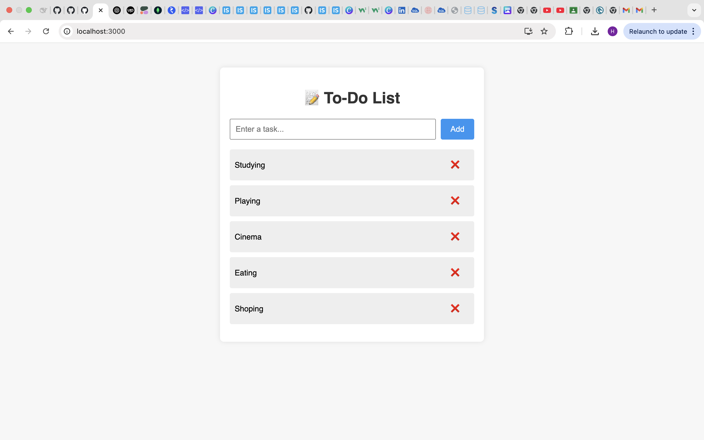

````markdown
# 📝 React To-Do List App

A simple and elegant **To-Do List** application built using **React.js**. It allows users to add and delete tasks dynamically, with changes reflected instantly on the same page — no reloads required!

---

## 🚀 Features

- ✅ Add tasks to your list
- ❌ Remove tasks with a single click
- ⚛️ Built with React.js (no backend required)
- 🔄 Fast, responsive UI with real-time updates

---

## 📸 Screenshot



> 💡 _Place your screenshot image (`screenshot.png`) in the root folder of your project._

---

## 🛠️ Getting Started

### 🔧 Prerequisites

- Node.js and npm installed
- A browser (like Chrome)

### 📦 Installation

```bash
git clone https://github.com/YourUsername/react-todo-app.git
cd react-todo-app
npm install
````

### ▶️ Run the app

```bash
npm start
```

The app will open in your browser at:
`http://localhost:3000`

---

## 🧠 Learnings

* React functional components
* React Hooks (`useState`)
* Props and component communication
* JSX styling
* Simple state management

---

## 📁 Folder Structure

```
todo-app/
├── public/
│   └── index.html
├── src/
│   ├── components/
│   │   └── TodoItem.js
│   ├── App.js
│   ├── index.js
│   └── App.css
├── README.md
└── package.json
```

---

## 📜 License

This project is licensed under the [MIT License](LICENSE).

---


## 🧑‍💻 Author

**Harshit Bansal**
🌐 [GitHub](https://github.com/HarsDev01)

---

````

